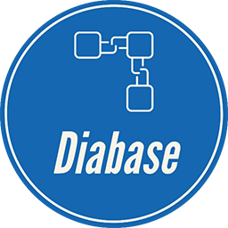

    
    
	 
    
    
    

---

Diabase Blockchain Core
===========================

https://www.diabasecoin.com/

What is Diabase?
-------------

Diabase Blockchain, the next evolution in digital wealth
preservation. Built upon the robust and secure X11 algorithm,
Diabase offers unparalleled protection for your assets. With
a unique focus on being a store of wealth, Diabase provides 
stability and long-term value appreciation.

Empowered by a network of masternodes, Diabase ensures swift
and secure transactions, maintaining the integrity of your
holdings. These masternodes contribute to network security,
enhancing decentralization and ensuring fast private transactions.
Diabase Core is the name of the open source software which enables
the use of this currency.

For more information, as well as an immediately useable, binary version of
the Diabase Core software, see https://www.diabasecoin.com/home/wallets

## Tech Specification
- Max Supply: 3,600,000 DIAC 
- Block Time: 90 seconds
- Block Reward: 5 DIAC (halving each year)
- Block Generation: 80% PoW | 20% Masternodes
- Mining Algorithm: X11
- ZERO Premine
- Difficulty Adjust, "Kimoto Gravity Well"(KGW) / "Dark Gravity Wave"(DGW)

Build Instructions can be found under docs!

License
-------

Diabase Core is released under the terms of the MIT license. See [COPYING](COPYING) for more
information or see https://opensource.org/licenses/MIT.

Development Process
-------------------

The `master` branch is meant to be stable. Development is normally done in separate branches.
[Tags](https://github.com/diabasecoin/diabase/tags) are created to indicate new official,
stable release versions of Diabase Core.

The contribution workflow is described in [CONTRIBUTING.md](CONTRIBUTING.md).

Testing
-------

Testing and code review is the bottleneck for development; we get more pull
requests than we can review and test on short notice. Please be patient and help out by testing
other people's pull requests, and remember this is a security-critical project where any mistake might cost people
lots of money.

### Automated Testing

Developers are strongly encouraged to write [unit tests](src/test/README.md) for new code, and to
submit new unit tests for old code. Unit tests can be compiled and run
(assuming they weren't disabled in configure) with: `make check`. Further details on running
and extending unit tests can be found in [/src/test/README.md](/src/test/README.md).

There are also [regression and integration tests](/test), written
in Python, that are run automatically on the build server.
These tests can be run (if the [test dependencies](/test) are installed) with: `test/functional/test_runner.py`

The Travis CI system makes sure that every pull request is built for Windows, Linux, and OS X, and that unit/sanity tests are run automatically.

### Manual Quality Assurance (QA) Testing

Changes should be tested by somebody other than the developer who wrote the
code. This is especially important for large or high-risk changes. It is useful
to add a test plan to the pull request description if testing the changes is
not straightforward.

Translations
------------

Changes to translations as well as new translations can be submitted to
[Diabase Core's Transifex page](https://www.transifex.com/projects/p/diabase/).

Translations are periodically pulled from Transifex and merged into the git repository. See the
[translation process](doc/translation_process.md) for details on how this works.

**Important**: We do not accept translation changes as GitHub pull requests because the next
pull from Transifex would automatically overwrite them again.

